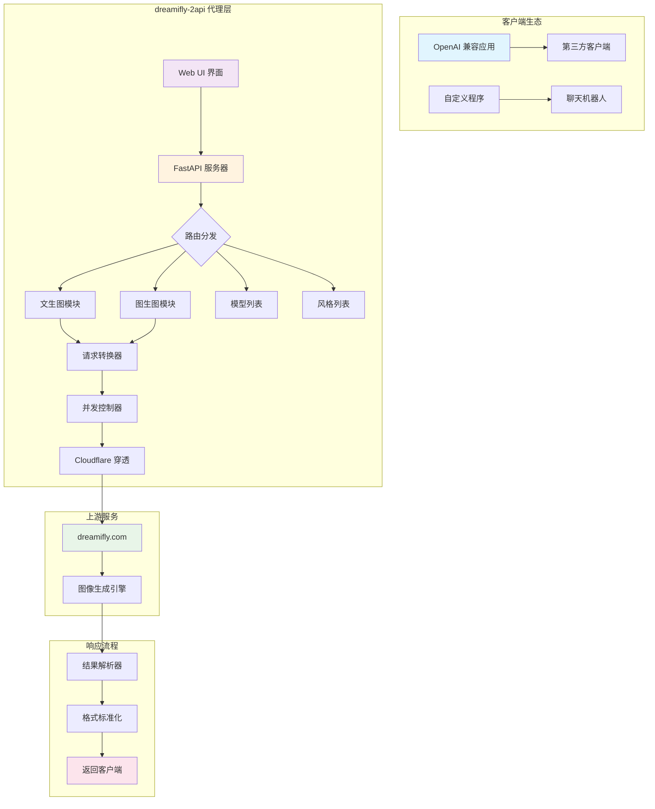
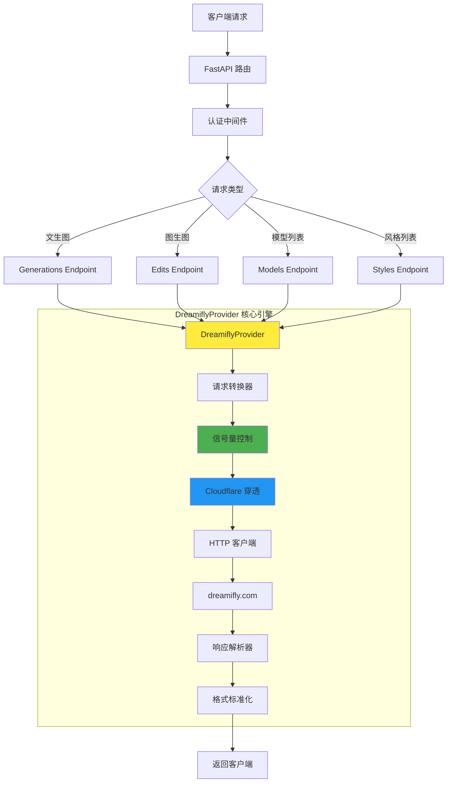

# 🚀 dreamifly-2api 🚀

<p align="center">
  <strong>将 dreamifly.com 图像生成功能转换为 OpenAI 格式 API 的高性能代理服务</strong>
</p>

<p align="center">
  <em>"我们不生产魔法，我们只是魔法的搬运工... 和翻译官。"</em> 🧙‍♂️
</p>

<p align="center">
  <a href="https://github.com/lzA6/dreamifly-2api/blob/main/LICENSE"></a>
  <a href="https://github.com/lzA6/dreamifly-2api/stargazers"></a>
  <a href="https://github.com/lzA6/dreamifly-2api/issues"></a>
  <a href="https://github.com/lzA6/dreamifly-2api/forks"></a>
</p>

<p align="center">
  <strong>中文</strong> | <a href="#">English (Coming Soon)</a>
</p>

---

> **致未来的开发者 & 梦想家们：**
>
> 在数字世界的浩瀚星海中，每一个 API 都是一颗独立的星球，拥有自己独特的语言和规则。`dreamifly-2api` 的诞生源于一个简单而纯粹的信念：**打破隔阂，连接美好**。我们相信，强大的创造力不应被复杂的接口所束缚。
>
> 这个项目就像一座精心建造的星际之桥，连接了 `dreamifly.com` 这颗充满奇幻色彩的创意星球，与 OpenAI 那片广袤的标准化生态宇宙。
>
> 这不仅仅是一段代码，这是我们对"开放、共享、创造"精神的致敬。它赋予了你，每一位开发者，用最熟悉的方式驾驭未知力量的能力。
>
> **世界的美，在于连接。代码的力，在于赋能。** 让我们一起，用代码为世界增添一抹新的亮色。🎨

---

## 📋 目录

- [🌟 项目亮点](#-项目亮点)
- [🤔 它解决了什么问题？](#-它解决了什么问题)
- [🏗️ 系统架构](#️-系统架构)
- [🛠️ 快速部署](#️-快速部署)
- [👨‍💻 手动部署](#-手动部署)
- [💡 API 使用指南](#-api-使用指南)
- [🔬 技术原理解析](#-技术原理解析)
- [🗂️ 项目结构](#️-项目结构)
- [🚀 未来规划](#-未来规划)
- [🤝 贡献指南](#-贡献指南)
- [📜 开源协议](#-开源协议)

---

## 🌟 项目亮点

<div align="center">

| 特性 | 描述 | 状态 |
|------|------|------|
| **OpenAI 格式兼容** | 无缝接入现有 OpenAI 生态 | ✅ 已实现 |
| **高性能异步架构** | 基于 FastAPI 和 asyncio | ✅ 已实现 |
| **Cloudflare 穿透** | 智能绕过防火墙挑战 | ✅ 已实现 |
| **并发控制** | 防止上游服务过载 | ✅ 已实现 |
| **文生图 & 图生图** | 支持两种生成模式 | ✅ 已实现 |
| **丰富风格支持** | 多种预设画风切换 | ✅ 已实现 |
| **Docker 化部署** | 一键启动，环境隔离 | ✅ 已实现 |
| **Web UI 界面** | 可视化测试面板 | ✅ 已实现 |

</div>

## 🤔 它解决了什么问题？

**痛点场景：**
- ❌ 无法将 dreamifly.com 集成到自己的应用中
- ❌ 接口不兼容，需要额外学习成本
- ❌ 无法使用 OpenAI 生态的成熟工具

**解决方案：**
- ✅ **翻译官角色**：将 OpenAI 格式转换为 dreamifly.com 格式
- ✅ **外交大使角色**：处理复杂的网络通信和认证
- ✅ **交通警察角色**：智能控制请求频率，保证稳定性

---

## 🏗️ 系统架构

<div align="center">



</div>

**架构说明：**
- 🔄 **请求流程**：客户端 → 代理层 → 上游服务 → 代理层 → 客户端
- 🛡️ **安全层**：API 密钥验证 + 并发控制 + Cloudflare 穿透
- 🔧 **转换层**：格式标准化 + 错误处理 + 结果解析
- 🚀 **性能层**：异步处理 + 连接池 + 智能重试

---

## 🛠️ 快速部署

### 环境要求

<div align="center">

| 工具 | 版本 | 说明 |
|------|------|------|
| Docker | 20.10+ | 容器运行时 |
| Docker Compose | 2.0+ | 容器编排 |
| 系统内存 | 2GB+ | 推荐 4GB |

</div>

### 部署步骤

**1. 克隆项目**
```bash
git clone https://github.com/lzA6/dreamifly-2api.git
cd dreamifly-2api
```

**2. 配置环境变量**
```bash
cp .env.example .env
```

编辑 `.env` 文件：
```dotenv
# ========================
# 🔐 安全配置
# ========================
API_MASTER_KEY=sk-your-super-secret-key-2024

# ========================
# 🚀 服务配置
# ========================
NGINX_PORT=8088
UPSTREAM_CONCURRENCY_LIMIT=2

# ========================
# 🔑 Dreamifly 认证
# ========================
DREAMIFLY_AUTH_TOKEN="Bearer your-actual-token-here"
```

**3. 获取认证令牌**

<div align="center">

| 步骤 | 操作 | 截图 |
|------|------|------|
| 1 | 打开 `https://dreamifly.com/zh` | 📱 |
| 2 | 按 `F12` 打开开发者工具 | 🛠️ |
| 3 | 切换到 **Network** 标签 | 🌐 |
| 4 | 生成一张图片 | 🖼️ |
| 5 | 找到 `generate` 请求 | 🔍 |
| 6 | 复制 `authorization` 头值 | 📋 |

</div>

**4. 启动服务**
```bash
docker-compose up -d
```

**5. 验证部署**
```bash
# 检查服务状态
docker-compose ps

# 查看服务日志
docker-compose logs -f app
```

### 访问地址

<div align="center">

| 服务 | 地址 | 说明 |
|------|------|------|
| API 服务 | `http://localhost:8088` | 主要的 API 端点 |
| Web UI | `http://localhost:8088/` | 可视化测试界面 |
| 健康检查 | `http://localhost:8088/health` | 服务状态检查 |

</div>

---

## 👨‍💻 手动部署

### 环境要求
- Python 3.10+
- pip 包管理器

### 部署步骤

**1. 克隆项目**
```bash
git clone https://github.com/lzA6/dreamifly-2api.git
cd dreamifly-2api
```

**2. 创建虚拟环境**
```bash
# Linux/macOS
python3 -m venv venv
source venv/bin/activate

# Windows
python -m venv venv
.\venv\Scripts\activate
```

**3. 安装依赖**
```bash
pip install -r requirements.txt
```

**4. 配置环境**
```bash
cp .env.example .env
# 编辑 .env 文件，配置认证信息
```

**5. 启动服务**
```bash
uvicorn main:app --host 0.0.0.0 --port 8000 --reload
```

---

## 💡 API 使用指南

### 认证方式
所有 API 请求都需要在 Header 中包含认证信息：
```http
Authorization: Bearer YOUR_API_MASTER_KEY
```

### 文生图 (Generate Image from Text)

**请求示例：**
```bash
curl -X POST "http://localhost:8088/v1/images/generations" \
  -H "Content-Type: application/json" \
  -H "Authorization: Bearer YOUR_API_KEY" \
  -d '{
    "model": "dreamifly-qwen-image",
    "prompt": "一只穿着宇航服的可爱猫咪，漂浮在太空中，背景是绚丽的星云，4k, best quality",
    "n": 1,
    "size": "1024x1024",
    "style": "卡通"
  }'
```

**参数说明：**
```json
{
  "model": "string, 必须，固定值: dreamifly-qwen-image",
  "prompt": "string, 必须，描述想要生成的图像内容",
  "n": "integer, 可选，生成图片数量，默认: 1",
  "size": "string, 可选，图片尺寸，默认: 1024x1024",
  "style": "string, 可选，图像风格"
}
```

### 图生图 (Generate Image from Image)

**请求示例：**
```bash
curl -X POST "http://localhost:8088/v1/images/edits" \
  -H "Authorization: Bearer YOUR_API_KEY" \
  -F "image=@/path/to/your/image.png" \
  -F "prompt=把它变成赛博朋克风格" \
  -F "model=dreamifly-qwen-edit" \
  -F "n=1" \
  -F "size=1024x1024"
```

### 获取模型列表
```bash
curl "http://localhost:8088/v1/models" \
  -H "Authorization: Bearer YOUR_API_KEY"
```

### 获取风格列表
```bash
curl "http://localhost:8088/v1/styles" \
  -H "Authorization: Bearer YOUR_API_KEY"
```

### 响应格式
所有接口都遵循 OpenAI 标准格式：

**成功响应：**
```json
{
  "created": 1677652288,
  "data": [
    {
      "url": "https://example.com/generated-image.png"
    }
  ]
}
```

**错误响应：**
```json
{
  "error": {
    "message": "错误描述",
    "type": "error_type",
    "code": "error_code"
  }
}
```

---

## 🔬 技术原理解析

### 核心组件架构

<div align="center">



</div>

### 关键技术深度解析

#### 1. 异步并发控制 (`asyncio.Semaphore`)

```python
class DreamiflyProvider:
    def __init__(self):
        # 限制同时只有2个请求访问上游服务
        self.semaphore = asyncio.Semaphore(settings.UPSTREAM_CONCURRENCY_LIMIT)
    
    async def generate_image(self, prompt: str, style: str = None):
        async with self.semaphore:  # 🚦 交通管制点
            # 只有获得"通行证"的请求才能继续
            return await self._call_upstream(prompt, style)
```

**设计理念：** 防止对上游服务的"洪水攻击"，确保服务稳定性。

#### 2. Cloudflare 穿透机制 (`cloudscraper`)

```python
import cloudscraper

class DreamiflyProvider:
    def __init__(self):
        # 创建能够绕过 Cloudflare 的智能客户端
        self.scraper = cloudscraper.create_scraper(
            browser={
                'browser': 'chrome',
                'platform': 'windows',
                'mobile': False
            }
        )
    
    async def _call_upstream(self, prompt: str):
        loop = asyncio.get_event_loop()
        # 在单独线程中执行同步请求，避免阻塞事件循环
        response = await loop.run_in_executor(
            None, 
            lambda: self.scraper.post(
                "https://dreamifly.com/api/generate",
                json={"prompt": prompt},
                headers={"Authorization": settings.DREAMIFLY_AUTH_TOKEN}
            )
        )
        return response
```

**技术要点：**
- 🛡️ **反反爬虫**：模拟真实浏览器行为
- 🚀 **异步兼容**：通过线程池执行同步操作
- 🔒 **认证处理**：自动携带认证令牌

#### 3. 配置管理系统 (`pydantic-settings`)

```python
from pydantic_settings import BaseSettings
from typing import Dict

class Settings(BaseSettings):
    # API 安全配置
    API_MASTER_KEY: str = "sk-default-key"
    
    # 上游服务配置
    DREAMIFLY_AUTH_TOKEN: str
    UPSTREAM_CONCURRENCY_LIMIT: int = 2
    
    # 模型映射配置
    MODEL_MAPPING: Dict[str, str] = {
        "dreamifly-qwen-image": "qwen-image",
        "dreamifly-qwen-edit": "qwen-edit"
    }
    
    class Config:
        env_file = ".env"

settings = Settings()
```

**优势：**
- ✅ **类型安全**：运行时类型验证
- ✅ **环境隔离**：支持多环境配置
- ✅ **自动加载**：从环境变量或 .env 文件读取

---

## 🗂️ 项目结构

```
dreamifly-2api/
├── 🐳 Docker 部署文件
│   ├── Dockerfile              # Python 应用容器配置
│   ├── docker-compose.yml      # 服务编排配置
│   └── nginx.conf              # Nginx 反向代理配置
│
├── 🐍 Python 应用代码
│   ├── main.py                 # FastAPI 应用入口
│   ├── requirements.txt        # Python 依赖列表
│   └── app/                    # 核心应用模块
│       ├── __init__.py
│       ├── core/               # 核心配置
│       │   ├── __init__.py
│       │   └── config.py       # 配置管理
│       ├── providers/          # 服务提供者
│       │   ├── __init__.py
│       │   ├── base_provider.py    # 提供者基类
│       │   └── dreamifly_provider.py # Dreamifly 实现
│       └── utils/              # 工具函数
│           └── sse_utils.py    # SSE 工具(预留)
│
├── 🌐 Web 界面
│   └── static/                 # 静态资源
│       ├── index.html          # Web UI 主页面
│       ├── style.css           # 样式文件
│       └── script.js           # 前端交互逻辑
│
├── 📝 配置文件
│   ├── .env.example            # 环境变量模板
│   └── .gitignore
│
└── 📚 文档
    ├── README.md               # 项目说明
    └── LICENSE                 # 开源协议
```

---

## 🚀 未来规划

### Phase 1: 核心功能 ✅
- [x] OpenAI 格式兼容
- [x] 基础文生图/图生图
- [x] Docker 化部署
- [x] Web 测试界面

### Phase 2: 增强稳定性 🚧
- [ ] 精细化错误处理
- [ ] 请求重试机制
- [ ] 健康检查端点
- [ ] 性能监控指标

### Phase 3: 高级功能 📅
- [ ] 多账户 Token 轮询
- [ ] 请求缓存机制
- [ ] 流式进度反馈
- [ ] 批量生成支持

### Phase 4: 生态扩展 🔮
- [ ] 插件化提供者系统
- [ ] 聊天模型代理支持
- [ ] 智能请求路由
- [ ] 管理员控制面板

---

## 🤝 贡献指南

我们欢迎所有形式的贡献！无论是代码改进、文档完善，还是新功能建议。

### 贡献流程

1. **Fork 项目**
   ```bash
   git clone https://github.com/lzA6/dreamifly-2api.git
   ```

2. **创建特性分支**
   ```bash
   git checkout -b feature/amazing-feature
   ```

3. **提交更改**
   ```bash
   git commit -m "Add amazing feature"
   ```

4. **推送分支**
   ```bash
   git push origin feature/amazing-feature
   ```

5. **创建 Pull Request**

### 开发规范
- 遵循 Python PEP 8 代码规范
- 为新增功能添加测试用例
- 更新相关文档
- 确保代码通过所有检查

---

<div align="center">

## 🎯 立即开始！

```bash
# 快速开始
git clone https://github.com/lzA6/dreamifly-2api.git
cd dreamifly-2api
docker-compose up -d
```

**访问 http://localhost:8088 开启你的创意之旅！**

[](https://star-history.com/#lzA6/dreamifly-2api&Date)

---

<p>Made with ❤️ and a bit of 🪄 by the community.</p>

</div>
